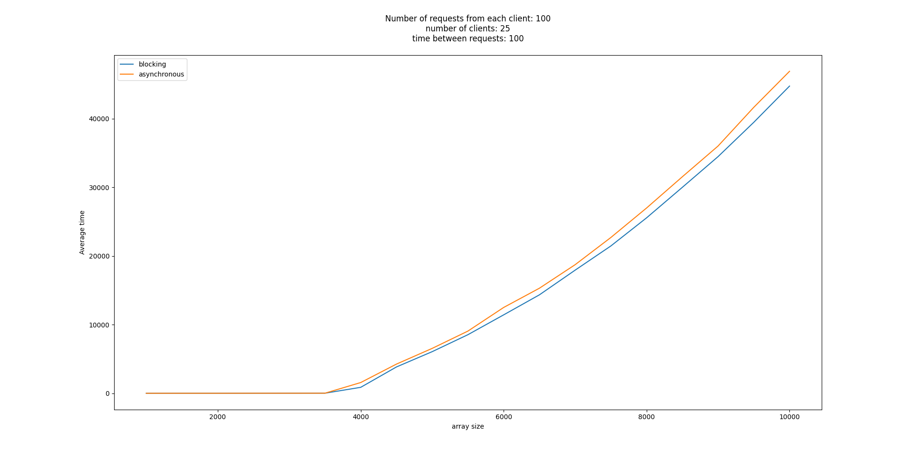
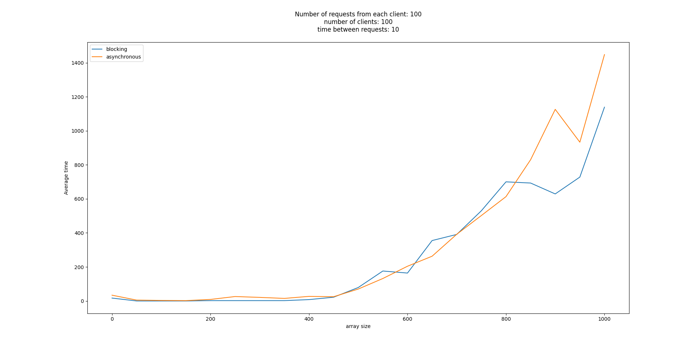
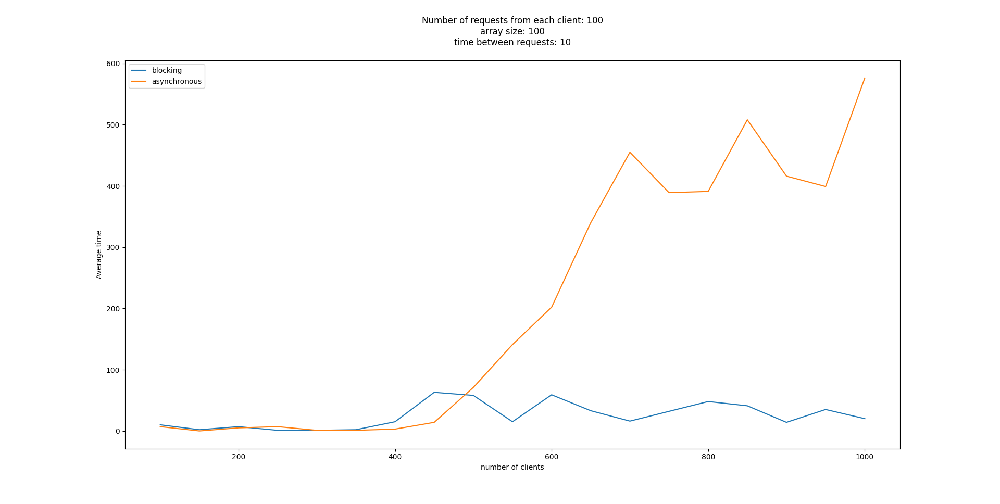
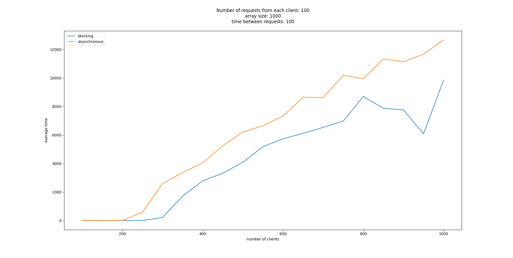
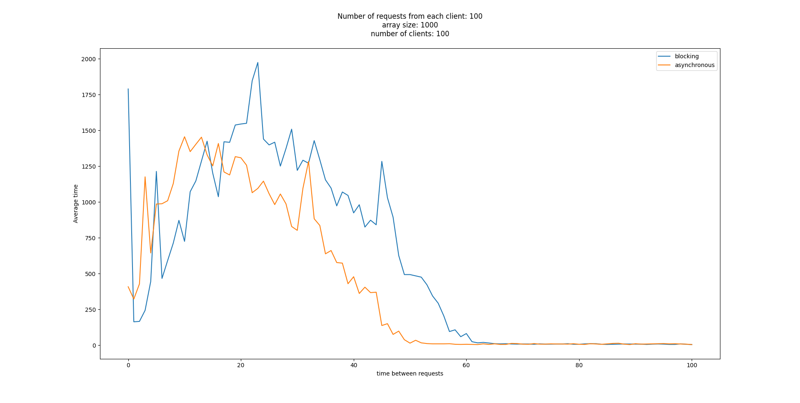
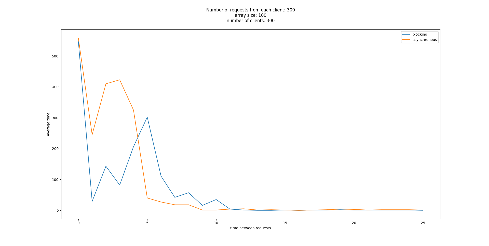

# Результаты

## Реализация

Я реализовал 2 архитектуры серверов: блокирующая и асинхронная. 

Измерение времени начинается после считывания сообщения от клиента и оканчивается после отправления запроса обратно.

## Полученные результаты

Если посылать на сервер большие массивы, то сервера будут вести себя похожим образом, тк основное время будет занимать обработка массива, а она работает одинаково на обоих архитектурах.

Большая разница между серверами видна в случае, когда много клиентов отправляют много маленьких массивов. В данном случае 
сервер на асинхронной архитектуре не успевает отправлять все данные клиенту.

На следующем графике видно, что блокирующая архитектура лучше справляется в ситуации, когда надо принять и отправить много информации клиенту. Скорее всего это происходит, тк в данном случае у нас реже происходит переключение контекста и мы быстрее обрабатываем запросы.

Тут я пытался проверить теорию "асинхронная архитектура лучше справится, если будет много маленьких запросов от клиентов". Если сообщения отсылаются быстрее, чем через 6-7 миллисекунд, то среднее время работы обеих архитектур сильно колеблется. Скорее всего это происходит из-за того, что я запускаю клиентов на том же компьютере, что и сервер, а разделить ядра нельзя.
Однако время обработки запроса в среднем быстрее сходится к константе, чем блокирующая архитектура. Это происходит, тк в случае многих запросов через маленькие промежутки времени, блокирующему серверу надо часто переключать потоки для чтения и вывода данных

